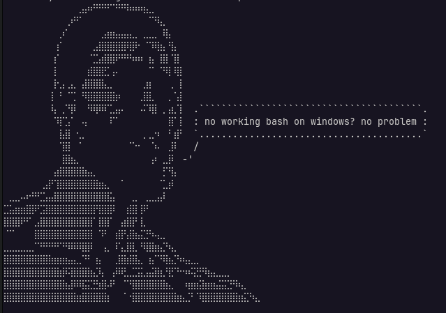
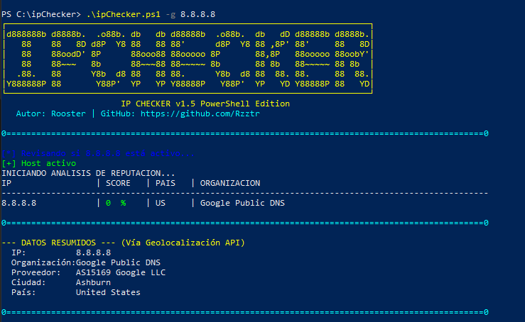

---
# LEE BIEN ESTE README

## IP Checker

Este proyecto es una herramienta desarrollada en Bash (`ipChecker.sh`) que permite analizar direcciones IP para obtener información sobre su reputación y detalles de red. Utiliza la API de AbuseIPDB para consultar el nivel de riesgo de una IP, así como `whois` y `ping` para obtener datos adicionales sobre la organización, el país y la disponibilidad del host.

### Colaboraciones al DM o mail: Ricardo.reyLop@proton.me

### Requisitos Previos

Para que el script funcione correctamente, asegúrate de tener instaladas las siguientes dependencias en tu sistema:

* `ping` (generalmente incluido por defecto en sistemas basados en Unix)
* `curl` (para realizar peticiones a la API)
* `jq` (para parsear la respuesta JSON de la API)
* `whois` (para obtener datos del registro de la IP)

Puedes instalar estas dependencias (en sistemas basados en Debian/Ubuntu) usando:

```bash
sudo apt update
sudo apt install curl jq whois

```

*(Nota: El repositorio incluye un archivo `install_deps.sh` que podría facilitar este proceso).*

---

### 🔐 Configuración de la API Key (.env)

Por motivos de seguridad, el script **no incluye una API Key incrustada de forma fija en el código**. En su lugar, lee las credenciales desde un archivo de entorno `.env`.

El repositorio incluye un archivo plantilla llamado `.env.example` que viene **vacío y sin claves de acceso**. Para configurarlo correctamente, sigue estos pasos:

#### Paso 1: Crear tu archivo .env

Copia la plantilla de ejemplo para crear tu archivo de configuración real:

```bash
cp .env.example .env

```

#### Paso 2: Agregar tu API Key

Regístrate en [AbuseIPDB](https://www.abuseipdb.com/), genera una clave de API y agrégala dentro de tu nuevo archivo `.env`:

```env
# Configuración del Script de Auditoría de IPs
ABUSEIPDB_API_KEY=tu_api_key_real_aqui

```

#### Paso 3: ¿Dónde ubicar el archivo `.env`?

El script es inteligente y buscará tu configuración en dos ubicaciones dependiendo de cómo lo ejecutes:

1. **Uso Local (Misma carpeta):** Si ejecutas el script con `./ipChecker.sh`, puedes dejar el archivo `.env` en esa misma carpeta.
2. **Uso Global (`/usr/local/bin/`):** Si moviste el script a los binarios del sistema para llamarlo desde cualquier parte de la terminal, coloca el archivo `.env` en la raíz de tu usuario (`~/.env` o `$HOME/.env`).

> ⚠️ **Nota Crítica para comandos con `sudo`:**
> Si ejecutas el script usando `sudo ipChecker.sh`, el sistema operativo limpia las variables de entorno de tu usuario y cambiará el `$HOME` al directorio de `root`. Si necesitas analizar logs del sistema que requieran privilegios elevados, asegúrate de copiar tu archivo `.env` también en la ruta del administrador:
> ```bash
> sudo cp ~/.env /root/.env
> 
> ```

---

### Uso

El script se puede ejecutar desde la terminal y soporta los siguientes modos principales de operación:

1. **Analizar una IP individual:**
Utiliza la opción `-g` o `--generar` seguida de la IP que deseas consultar (realiza Ping, Reputación en AbuseIPDB y Resumen WHOIS).
```bash
ipChecker.sh -g 8.8.8.8

```
2. **Analizar una lista de IPs:**
Utiliza la opción `-i` o `--lista` seguida de un archivo de texto con las direcciones IP (una por línea). Puedes agregar la bandera `-o` al final para exportar un reporte en texto plano.
```bash
ipChecker.sh -i lista_ips.txt -o

```
3. **Auditoría WHOIS Completa:**
Extrae el registro WHOIS detallado de una o varias IPs mapeadas en un archivo.
```bash
ipChecker.sh -w lista_ips.txt

```
4. **Verificación de Red Tor:**
Comprueba si una dirección IP pertenece a un nodo de salida activo de la red Tor.
```bash
ipChecker.sh --tor 123.45.67.89

```
5. **Ayuda:**
Para ver el desglose completo de opciones y ejemplos prácticos:
```bash
ipChecker.sh -h

```
---

### Notas Importantes

* Otorga permisos de ejecución al script antes de intentar correrlo por primera vez:
```bash
chmod +x ipChecker.sh

```
* **Seguridad:** El archivo `.env` local ya se encuentra agregado al archivo `.gitignore` del repositorio para prevenir que subas accidentalmente tus credenciales privadas a plataformas de control de versiones como GitHub.

---

## No quieres instalar Linux | WSL? 



Powershell: Se añadio un script powershell en el git, solo navega hasta el directorio en tu terminal Powershell y usa el script de manera normal.

* En caso de un problema de ejecucion, lo mas seguro es un requerimiento de permisos. Solo EJECUTA COMO ADMINISTRADOR, antes de ejecutar el checker, ejecuta este comando: 

```bash
powershell -ExecutionPolicy Bypass

```



---

> NO NOS HACEMOS RESPONSABLES DEL MAL USO DE ESTE SCRIPT, DESDE EL USO DESMEDIDO DE HOST PARA ATAQUES; HASTA EL POTENCIAL USO PARA HACER MISILES NUCLEARES O ATAQUES ALIENIGENAS. NOS RESERVAMOS DE CUALQUIER FIN Y USO MALICIOSO QUE PUEDA DARSE BAJO LA IMAGINACION DEL USUARIO.
